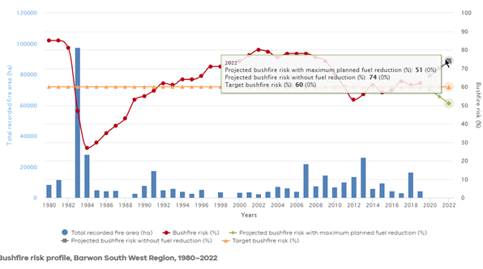
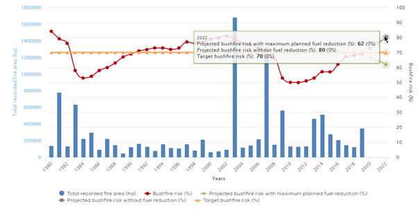

# Climate change overview


## *Problem definition*

1. Human-induced climate change is a problem that will require a united, global effort to combat. However, the effects of climate change do and will continue to affect Forrest at a community level. Such affects include increasing temperatures, drying climates, increased and more serious bushfires, droughts, and more extreme weather. To remain safe and stay resilient in the face of climate change, Forrest must anticipate more frequent bushfires, flooding and drought, and develop plans for sustainable recovery.

*Dynamic hypothesis:*

Forrest is vulnerable to bushfires and drought, and the effect of climate change on biodiversity may begin to affect Forrest’s eco-tourism economy. Increasing temperatures will also affect Forrest’s residents, especially as the community is ageing. More frequent heatwaves will put older people, more susceptible to heat-induced illness, at risk. Forrest is occasionally subject to flooding (e.g. the spillover of Barwon Dam in 2012), and with the increase in extreme weather events this could become more frequent.


## *System conceptualisation*

There are three main drivers in the Climate Change component: bushfire, increasing temperatures, and flooding. 

### Bushfire
Bushfire is a complex phenomenon which is driven by many local scale factors. We have adapted the wildfire model from Collins et al. (2013) to model bushfire dynamics, and then built in an occurrence structure for regular bushfire and catastrophic bushfire. For regular bushfire, we modelled the joint occurrence of higher temperatures, lower rainfall, fires per year and relative fire intensity. For catastrophic bushfire, we assumed these same four inputs but with greater thresholds.

### Increasing temperature
Here we used a lookup table based upon the "temperature change from preindustrial" structure found in the FeliX model, with the BAU scenario, which assumes a temperature change of +1.85 degrees C by 2050.

### Flooding
Climate change is also predicted to increase flooding due to more intense rain events. Additionally, Forrest is close to and down slope from the West Barwon Dam. Here we assumed that rainfall in excess of the 95th percentile of historical data will result in flooding.


## *Model formulation*


***

## *Equations*


## Rainfall
### Data used:

BOM rainfall monthly/annual averages 1889-2014
Barwon Downs; station no. 090004

PhD/Data/Rainfall/rainfall.csv

### Visualise data
```{r}
library(readr)
rainfall <- read_csv("C:/Users/szeteyka/OneDrive - Deakin University/PhD/Data/Rainfall/rainfall.csv")
rainfall <- rainfall$Annual
is.numeric(rainfall)
summary(rainfall)
hist(rainfall)
sd(rainfall)

```

### Vensim
RANDOM NORMAL( 390, 1210, 781, 151, 0)

## Temperature
### Data used

BOM monthly average temperatures 1864-2020

Cape Otway; station no. 90015

PhD/Data/Temperature/daily_temp.csv


```{r}
library(readr)
daily_temp <- read_csv("C:/Users/szeteyka/OneDrive - Deakin University/PhD/Data/Temperature/daily_temp.csv")
```

### Visualise data
```{r}
daily_temp <- na.omit(daily_temp)
summer <- daily_temp[daily_temp$Month == 1 | daily_temp$Month == 2 | daily_temp$Month == 12, ]
hist(summer$max)
hist(daily_temp$max)

summary(summer$max)
summary(daily_temp$max)
quantile(summer$max, c(0.90))
```

### Fit data to distribution

```{r warning = FALSE}
library(fitdistrplus)
plotdist(summer$max, histo = TRUE, demp = TRUE)
plotdist(daily_temp$max)
descdist(summer$max, boot = 1000)
descdist(daily_temp$max, boot = 1000)
```
```{r warning = FALSE}
fw <- fitdist(summer$max, "weibull")
fw <- fitdist(daily_temp$max, "weibull")
summary(fw)
```

```{r}
fg <- fitdist(summer$max, "gamma")
fg <- fitdist(daily_temp$max, "gamma")
summary(fg)
```

```{r}
fln <- fitdist(summer$max, "lnorm")
fln <- fitdist(daily_temp$max, "lnorm")
summary(fln)

```

```{r}
par(mfrow = c(2, 2))
plot.legend <- c("Weibull", "lognormal", "gamma")
denscomp(list(fw, fln, fg), legendtext = plot.legend)
qqcomp(list(fw, fln, fg), legendtext = plot.legend)
cdfcomp(list(fw, fln, fg), legendtext = plot.legend)
ppcomp(list(fw, fln, fg), legendtext = plot.legend)
```
```{r warning = FALSE}


par(mfrow = c(1, 1))
library(actuar)
s.ll <- fitdist(summer$max, "llogis", start = list(shape = 1, scale = 500))
s.pr <- fitdist(summer$max, "pareto", start = list(shape = 1, scale = 500))
s.br <- fitdist(summer$max, "burr", start = list(shape1 = 0.3, shape2 = 1, rate = 1))
s.ll <- fitdist(daily_temp$max, "llogis", start = list(shape = 1, scale = 500))
s.pr <- fitdist(daily_temp$max, "pareto", start = list(shape = 1, scale = 500))
s.br <- fitdist(daily_temp$max, "burr", start = list(shape1 = 0.3, shape2 = 1, rate = 1))
cdfcomp(list(fln,s.ll, s.pr, s.br, fw, fg), xlogscale = TRUE, ylogscale = TRUE, 
        legendtext = c("lognormal", "loglogistic", "Pareto", "Burr", "Weibull", "gamma"))

```

```{r}
library(DescTools)

Gmean(summer$max, method = "classic")
Gsd(summer$max, na.rm = FALSE)

Gmean(daily_temp$max, method = "classic")
Gsd(daily_temp$max, na.rm = FALSE)

log(43.4) #ln max value

log(20.346) #ln geometric mean
log(16.64)
```


### Vensim

Best fit distribution to match summer temperature data is Burr, however Vensim does not have this distribution. Instead choose random lognormal.

General code for random lognormal: 
EXP(RANDOM NORMAL(-[something large], ln(max value), ln(geometric mean), geometric SD, 0)

EXP(RANDOM NORMAL(-6, 3.77, 3.013, 1.24, 0))


## Annual probability of bushfire in Otways
[Barwon South West bushfire risk modelling](https://www.ffm.vic.gov.au/fuel-management-report-2018-19/whats-happening-near-me/barwon-south-west-region)



### Vensim

Using the bushfire risk as at 2022 (51% if fuel reduction burns occur, 74% if not)
Rainfall distribution less than 1st quartile (681.9mm)
Temperature distribution greater than 90th percentile (28.3 °C)

(IF THEN ELSE(fuel reduction burning = 1, 0.51, 0.74))* (IF THEN ELSE( rainfall distribution < 682, 1, 0)) *(IF THEN ELSE( temperature distribution > 28.3, 1, 0))

## Annual probability of bushfire elsewhere in Victoria

[Statewide bushfire risk modelling](https://www.ffm.vic.gov.au/fuel-management-report-2018-19/statewide-achievements/bushfire-risk)

Using the bushfire risk as at 2022 (62% if fuel reduction burns occur, 80% if not)

### Vensim

IF THEN ELSE(fuel reduction burning > 0, 0.8, 0.62)



## Average annual visitor numbers

[Tourism data](https://www.tra.gov.au/Regional/local-government-area-profiles)

1,363,000 annual visitor nights spent in Colac Otway Shire in 2019

Assume one quarter of these visit Forrest (340,750).

Assume effect of bushfire will halve this (170,375)

Reduce by one quarter if fuel reduction burning = yes (85,187)

<span style="background-color: #FFFF00">Pollution of local waterbodies: ?</span> If waterbodies are polluted, the number of visitor nights reduced increases exponentially with the level of pollution.

### Vensim

(IF THEN ELSE(annual probability of bushfire in Otways > 0.5, 170375, 340750))-(IF THEN ELSE(fuel reduction burning = 1, 85187, 0))-(EXP(pollution of local waterbodies))

## Tourism income recovery rate

Visitor nights increase by one quarter if bushfire elsewhere = yes (85,187)

### Vensim

IF THEN ELSE(annual probability of bushfire elsewhere in Victoria > 0, 85187, 0)*143

## Tourism income inflow rate

If a catastrophic bushfire occurs, then all tourism will cease.

If not, then the tourism income will be number of visitor nights x $143 (total tourism spend per night)

### Vensim

IF THEN ELSE(probability of catastrophic bushfire = 1, 0, average annual visitor numbers*143)

## Loss of income from tourism

Initial value = one quarter of Colac Otway visitor nights (340,750) x spend per night ($143) 
= 48,727,250

### Vensim

INTEG(tourism income recovery rate - tourism income inflow rate)

## Impact of livestock on waterbodies

Use Nitrate + Nitrite as N (mg/L) as a proxy variable

Data from (https://data.water.vic.gov.au/) for Water Quality in a rectangle drawn around Forrest

PhD/Data/Water Quality/Nitrogen.csv

### Visualise data

```{r}
library(readr)
nitrogen <- read_csv("C:/Users/szeteyka/OneDrive - Deakin University/PhD/Data/Water quality/Nitrogen.csv")
hist(nitrogen$Point)

library(fitdistrplus)
plotdist(nitrogen$Point, histo = TRUE, demp = TRUE)
descdist(nitrogen$Point, boot = 1000)
sd(nitrogen$Point)
```
```{r}
library(actuar)
fw <- fitdist(nitrogen$Point, "weibull")
summary(fw)
fg <- fitdist(nitrogen$Point, "gamma")
summary(fg)
fln <- fitdist(nitrogen$Point, "lnorm")
fb <- fitdist(nitrogen$Point, "beta")
summary(fb)

summary(fln)

```

```{r}
par(mfrow = c(2, 2))
plot.legend <- c("Weibull", "lognormal", "gamma")
denscomp(list(fw, fln, fg), legendtext = plot.legend)
qqcomp(list(fw, fln, fg), legendtext = plot.legend)
cdfcomp(list(fw, fln, fg), legendtext = plot.legend)
ppcomp(list(fw, fln, fg), legendtext = plot.legend)
```
```{r}
summary(nitrogen$Point)
sd(nitrogen$Point)
summary(fg)
```


### Vensim
Gamma is the closest distribution.

RANDOM GAMMA(0.002, 0.76, 1.1, 0.105, 0.137, 0)


## Pollution of local waterbodies

```{r}
library(readr)
nitrogen <- read_csv("C:/Users/szeteyka/OneDrive - Deakin University/PhD/Data/Water quality/Nitrogen.csv")
hist(nitrogen$Point)
summary(nitrogen$Point)
```

### Vensim

#IF THEN ELSE(impact of livestock on waterbodies > 0.1675 1, 0)

#0.1675 is 3rd quartile of turbidity dataset

Testing with IF THEN ELSE(impact of regenerative agriculture = 1, (impact of livestock on waterbodies) *0.5, impact of livestock on waterbodies)


## Probability of catstrophic bushfire

[Victorian Auditor General's Report: Reducing Bushfire Risks, October 2020](https://www.audit.vic.gov.au/report/reducing-bushfire-risks)

DELWP modelling for Fire Danger Index (FDI) 130 (Black Saturday occurred under FDI 130)

Severe drought: set rainfall to be <10th decile

Extreme temperature: set temperature to be >= 40° C

Additional factors in Black Saturday were relative humidity <10% and strong to gale-force winds - not modelling this for now.

```{r}
library(readr)
rainfall <- read_csv("C:/Users/szeteyka/OneDrive - Deakin University/PhD/Data/Rainfall/rainfall.csv")
rainfall <- rainfall$Annual

quantile(rainfall, c(0.10))

```


### Vensim

IF THEN ELSE( temperature distribution >= 40, 1, 0)* IF THEN ELSE( rainfall distribution <599.63, 1, 0) *IF THEN ELSE(fuel reduction burning = 0, 1, 0)

## Annual probability of flooding

[Floodplain management in Colac Otway Shire](https://www.ccmaknowledgebase.vic.gov.au/flood/resources/Colac%20Otway%20Shire_Brochure.pdf)

Forrest is in an area with a 1% AEP.

Annual Exceedance Probability (AEP): A flood with a 1% AEP has a one in a hundred chance of being exceeded in any year.

### Vensim

0.01 floods/year

## Rate of land use change

### Data used
[Victoria's Land Use Cover Time Series](https://www.environment.vic.gov.au/biodiversity/Victorias-Land-Cover-Time-Series)

Using Otway Ranges bioregion data (Forrest is on the edge of the Otway Ranges and Otway Plain bioregions)

Take geometric mean of percentage land use change. Use formula as per [Habib (2012)](https://www.arpapress.com/Volumes/Vol11Issue3/IJRRAS_11_3_08.pdf) to include zero and negative values.

```{r}
# vector of percentage land use change in Otway Ranges bioregion between 1985-2019
luc <- c(-54, 71, -38, -11, -64, 259, 11, 52, 0, -58, -42, 0, -83, -19, 6, 250, -78, -58)

# vector of hectare land use change in Otway Ranges bioregion between 1985-2019
#luc <- c(-1, 136, -2, -1527, -1, 409, 479, 94, 0, -194, -94, 601, -10, -33, -33, 0, -121, -40)

# extract negative values
luc.neg <- luc[luc < 0]
# extract positive values
luc.pos <- luc[luc > 0]
# extract zero values
luc.0 <- luc[luc = 0]
# take absolute value of negative values
luc.neg.abs <- abs(luc.neg)

library(DescTools)
# Take geometric mean G_pos
G_pos <- Gmean(luc.pos)
# Take geometric mean G_neg
G_neg <- Gmean(luc.neg.abs)
# Geometric mean of negative values G_neg = -G_|-(luc.neg)|
G_neg <- -(G_neg)
G_neg  
# Geometric mean of zero values (for completeness)
G_0 <- 0

N <- length(luc)  
N_pos <- length(luc.pos)
N_neg <- length(luc.neg)
N_0 <- length(luc.0)
N
N_pos
N_neg
N_0

# Overall geometric mean is weighted average (sum?)

GM <- ((N_pos/N)*G_pos) + ((N_neg/N)*G_neg) + ((N_0/N)*G_0)
GM
```

## Impact of regenerative agriculture

Testing this variable with a binomial distribution, with P = 0.5 (e.g. regen agriculture either yes or no). Will likely need to modify this, perhaps to a(n increasing?) distribution with percentage of farms converted.

### Vensim

RANDOM BINOMIAL(0, 1, 0.5, 1, 0, 1, 0)

***
New stuff after here

annual probability of flood=
        0.01
    Units: Dmnl
    
bushfire risk fraction=
    reference FFDI/FFDI model
Units: Dmnl

climate damage fraction=
    1/(1+climate damage scale*(temperature change since 1865/reference temperature for climate damages
)^climate damage nonlinearity)
Units: Dmnl
Fraction of Output lost to combating Climate Change.

climate damage nonlinearity=
    2
Units: Dmnl
Nonlinearity of Climate Damage Cost Fraction.

climate damage scale=
    0.013
Units: Dmnl
Climate Damage Fraction at Reference Temperature.

CO2 change=
    CO2 linear model-reference CO2
Units: ppm

CO2 linear model=
    CO2 model coefficient*Time - 3177.44
Units: ppm
Cape Grim data modelled y-intercept -3177.44

CO2 model coefficient=
    1.77
Units: ppm/Year
Cape Grim linear model of CO2 increase

Cultural Burning= INTEG (
    Cultural burning rate,
        0)
Units: Dmnl

cultural burning adjustment time=
    15
Units: Year
Victorian Cultural Fire Strategy states a 10 year transition 
        time to properly implement cultural burning, as Country is 
        currently too sick to immediatly begin cultural burns. We assume 
        an additional 5 years to implement the strategy.

cultural burning discrepancy=
    cultural burning goal-Cultural Burning
Units: Dmnl

cultural burning goal=
    1
Units: Dmnl
The goal is to have 100% of land managed by cultural burning

Cultural burning rate=
    IF THEN ELSE(Time < 2025, 0, (cultural burning discrepancy/cultural burning adjustment time
)*cultural burning scenario switch)
Units: 1/Year
Assume that cultural burning won't commence until 2025

cultural burning scenario switch=
    0
Units: Dmnl

FFDI model=
    (FFDI model coefficient*Time) - 51.7397
Units: Dmnl
linear model of FFDI dataset from 1990-2020

FFDI model coefficient=
     0.02662
Units: 1/Year
Coefficient of linear model of FFDI dataset 1990-2020

net climate change impact on economy=
    climate damage fraction
Units: Dmnl
The fraction of ecomomy output loss due to climate change.

rainfall change=
    rainfall linear model-reference rainfall
Units: mm

rainfall linear model=
    (rainfall model coefficient*Time)+ 6182.65
Units: mm
Intercept calculated from linear model for data 1990-2020 for 
        Pennyroyal weather station

rainfall model coefficient=
    -2.711
Units: mm/Year
Coefficient of linear model of annual rainfall since 1990 using 
        Pennyroyal weather station data

reference CO2=
    348.33
Units: ppm
CO2 mean Cape Grim data for 1976-2000

reference FFDI=
    1.4
Units: Dmnl
FFDI as at 1973; first year of data for linear model

reference rainfall=
    776
Units: mm
Pennyroyal rainfall measuring station; mean of annual rainfall 
        1960-2020

reference temperature 1865=
    16.6
Units: DegreesC
Earliest available full year dataset for Cape Otway climate 
        station

reference temperature for climate damages=
    3
Units: DegreesC
Reference Temperature for Calculation of Climate Damages.

temperature change since 1865=
    temperature linear model-reference temperature 1865
Units: DegreesC

temperature linear model=
    (temperature model coefficient*Time)-47.88
Units: DegreesC
Modelled intercept of equation = -47.87707

temperature model coefficient=
    0.03241
Units: DegreesC/Year
Coefficient of linear model of Cape Otway annual mean 
        temperatures from 1990-2020

TIME STEP  = 0.25
Units: Year [0,?]
The time step for the simulation.


